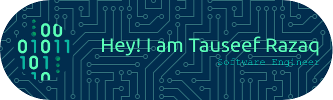

## 👋 About Me

Hi! I'm [Tauseef Razaq](https://tauseefrazaq.com), a passionate software engineer with a focus on Software design and Operations. I enjoy working on innovative projects and learning new technologies to solve real-world problems.

- I’m currently learning devOps.
- Open to new opportunities in Software Business.
- Studying Software Engineering at FAST - National University.
- Reach me at: tauseefrazaq71@gmail.com

## 🛠️ Skills

- **Languages:** C/C++, Java, Python, Javascipt/Typescript. 
- **Frameworks & Libraries:** MERN
- **Tools & Platforms:** Git/Github, Docker, K8s, Linux, Figma
- **Databases:** MySQL, PostgreSQL, MongoDB.

## 📬 Contact

- **Email:** tauseefrazaq71@gmail.com
- **LinkedIn:** [Tauseef Razaq](https://www.linkedin.com/in/tauseef-razaq-59b284253)

---

*Thank you for visiting my GitHub profile! Feel free to check out my projects and get in touch.*

